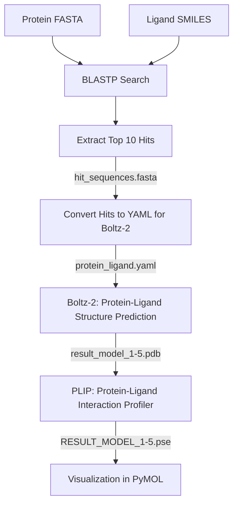

# Boltzflow

## Description
**Pipeline automatisé** pour identifier et prédire la structure de complexes protéine-ligand.

Le pipeline suit ces étapes principales :  
1. BLAST pour identifier les séquences homologues : `[PATH]\Boltzflow\blastp_results`
2. Prédiction des structures protéine-ligand avec Boltz-2 : `[PATH]\Boltzflow\boltz_results`
3. Identification des interactions protéine-ligand avec PLIP :
     - Exemple de résultats pour le hit '4W6Z' : `[PATH]\Boltzflow\boltz_results\4W6Z_NAD\predictions\plip_results_model_[0-4]\` 
5. Visualisation des résultats de PLIP en fichier xml, txt et session PyMOL :
     - Pymol: `RESULT_MODEL_1_PROTEIN_LIG_B_1.pse`
     - XML ou TXT: `result_model_1_report(.xml/.txt)`

## Pipeline Workflow


## Usages
**Snakemake** (quelques soucis techniques avec Boltz et PLIP)
```
conda activate snakemake
cd Boltzflow/
snakemake --use-conda --cores 8
```
**Bash**
```
conda env create -f envs/boltz.yaml
conda activate boltz
cd Boltzflow/
bash bash_worflow.sh
```
## Résultats
* Séquence query : `data/P00330.fasta` : Alcohol dehydrogenase 1 de Saccharomyces cerevisiae - Code Uniprot : [P00330](https://www.uniprot.org/uniprotkb/P00330/entry)
* Son ligand : `data/NAD_smiles.txt` : NAD (Nicotineamide-Adenine-Dinucleotide) - ID PDB du complexe : [5ENV](https://www.rcsb.org/structure/5ENV)
* Les 10 hits homologues identifiés par BlastP : `blastp_results/blastp_results.tsv` : 

| sseqid       | % Identity | Length | Mismatch | Gaps | qstart | qend | sstart | send | E-value | Bitscore |
| ------------ | ---------- | ------ | -------- | ---- | ------ | ---- | ------ | ---- | ------- | -------- |
| NP_014555.1  | 100.000    | 348    | 0        | 0    | 1      | 348  | 1      | 348  | 0.0     | 712      |
| AAA34410.1   | 99.713     | 348    | 1        | 0    | 1      | 348  | 1      | 348  | 0.0     | 710      |
| CAI4935810.1 | 99.713     | 348    | 1        | 0    | 1      | 348  | 1      | 348  | 0.0     | 710      |
| CAI4735147.1 | 99.425     | 348    | 2        | 0    | 1      | 348  | 1      | 348  | 0.0     | 709      |
| CAI4989944.1 | 99.425     | 348    | 2        | 0    | 1      | 348  | 1      | 348  | 0.0     | 709      |
| AJT71859.1   | 99.425     | 348    | 2        | 0    | 1      | 348  | 1      | 348  | 0.0     | 709      |
| 4W6Z_A       | 100.000    | 347    | 0        | 0    | 2      | 348  | 1      | 347  | 0.0     | 709      |
| CAI4778562.1 | 99.425     | 348    | 2        | 0    | 1      | 348  | 1      | 348  | 0.0     | 709      |
| AGS12574.1   | 99.425     | 348    | 2        | 0    | 1      | 348  | 1      | 348  | 0.0     | 709      |
| CAI7456855.1 | 99.425     | 348    | 2        | 0    | 1      | 348  | 1      | 348  | 0.0     | 708      |

* Prédiction de 5 models de structures par hits avec Boltz
* Exemples des interactions qui existe entre **4W6Z** et **NAD** :
* --> Aperçu du fichier : `[PATH]\Boltzflow\boltz_results\4W6Z_NAD\predictions\plip_results_model_0`
```
Prediction of noncovalent interactions for PDB structure RESULT_MODEL_0_PROTEIN
===============================================================================
Created on 2026/02/02 using PLIP v3.0.0

If you are using PLIP in your work, please cite:
Schake,P. Bolz,SN. et al. PLIP 2025: introducing protein–protein interactions to the protein–ligand interaction profiler. Nucl. Acids Res. (10 May 2025), gkaf361. doi: 10.1093/nar/gkaf361
Analysis was done on model 1.

LIG:B:1 (LIG) - SMALLMOLECULE
-----------------------------
Interacting chain(s): A


**Hydrophobic Interactions**
+-------+---------+----------+-----------+-------------+--------------+------+--------------+---------------+-----------------------+-----------------------+
| RESNR | RESTYPE | RESCHAIN | RESNR_LIG | RESTYPE_LIG | RESCHAIN_LIG | DIST | LIGCARBONIDX | PROTCARBONIDX | LIGCOO                | PROTCOO               | 
+=======+=========+==========+===========+=============+==============+======+==============+===============+=======================+=======================+
| 157   | THR     | A        | 1         | LIG         | B            | 3.61 | 2587         | 1183          | -2.417, 1.964, -4.263 | -2.300, 4.702, -1.907 | 
+-------+---------+----------+-----------+-------------+--------------+------+--------------+---------------+-----------------------+-----------------------+
| 182   | LEU     | A        | 1         | LIG         | B            | 3.99 | 2588         | 1357          | -2.982, 0.761, -3.838 | -5.340, 2.514, -1.142 | 
+-------+---------+----------+-----------+-------------+--------------+------+--------------+---------------+-----------------------+-----------------------+


**Hydrogen Bonds**
+-------+---------+----------+-----------+-------------+--------------+-----------+----------+----------+-----------+-----------+----------+-----------+-------------+--------------+------------------------+------------------------+
| RESNR | RESTYPE | RESCHAIN | RESNR_LIG | RESTYPE_LIG | RESCHAIN_LIG | SIDECHAIN | DIST_H-A | DIST_D-A | DON_ANGLE | PROTISDON | DONORIDX | DONORTYPE | ACCEPTORIDX | ACCEPTORTYPE | LIGCOO                 | PROTCOO                | 
+=======+=========+==========+===========+=============+==============+===========+==========+==========+===========+===========+==========+===========+=============+==============+========================+========================+
| 44    | HIS     | A        | 1         | LIG         | B            | False     | 2.02     | 3.00     | 173.04    | True      | 341      | Nam       | 2598        | O3           | -7.107, -2.723, -1.210 | -6.577, -4.769, -3.343 | 
+-------+---------+----------+-----------+-------------+--------------+-----------+----------+----------+-----------+-----------+----------+-----------+-------------+--------------+------------------------+------------------------+
| 48    | HIS     | A        | 1         | LIG         | B            | True      | 3.16     | 3.63     | 111.98    | False     | 2625     | O3        | 383         | N2           | -6.394, -0.722, -6.729 | -9.206, -1.900, -8.707 | 
+-------+---------+----------+-----------+-------------+--------------+-----------+----------+----------+-----------+-----------+----------+-----------+-------------+--------------+------------------------+------------------------+
| 177   | GLY     | A        | 1         | LIG         | B            | False     | 3.14     | 3.48     | 101.97    | True      | 1328     | Nam       | 2616        | N2           | -17.265, 2.831, -0.158 | -14.623, 4.492, 1.384  | 
+-------+---------+----------+-----------+-------------+--------------+-----------+----------+----------+-----------+-----------+----------+-----------+-------------+--------------+------------------------+------------------------+
| 181   | GLY     | A        | 1         | LIG         | B            | False     | 1.87     | 2.85     | 173.80    | True      | 1346     | Nam       | 2602        | O3           | -10.006, -3.420, 0.716 | -8.985, -2.129, 3.048  | 
+-------+---------+----------+-----------+-------------+--------------+-----------+----------+----------+-----------+-----------+----------+-----------+-------------+--------------+------------------------+------------------------+
| 182   | LEU     | A        | 1         | LIG         | B            | False     | 1.81     | 2.79     | 171.31    | True      | 1350     | Nam       | 2597        | O2           | -8.269, -0.833, 0.015  | -7.049, -0.032, 2.389  | 
+-------+---------+----------+-----------+-------------+--------------+-----------+----------+----------+-----------+-----------+----------+-----------+-------------+--------------+------------------------+------------------------+
| 206   | LYS     | A        | 1         | LIG         | B            | True      | 2.19     | 3.18     | 161.48    | True      | 1527     | N3        | 2621        | O3           | -14.317, -1.290, 2.004 | -16.560, -3.367, 2.873 | 
+-------+---------+----------+-----------+-------------+--------------+-----------+----------+----------+-----------+-----------+----------+-----------+-------------+--------------+------------------------+------------------------+
| 206   | LYS     | A        | 1         | LIG         | B            | True      | 2.25     | 3.18     | 160.56    | False     | 2621     | O3        | 1527        | N3           | -14.317, -1.290, 2.004 | -16.560, -3.367, 2.873 | 
+-------+---------+----------+-----------+-------------+--------------+-----------+----------+----------+-----------+-----------+----------+-----------+-------------+--------------+------------------------+------------------------+
| 247   | VAL     | A        | 1         | LIG         | B            | False     | 3.02     | 3.89     | 148.36    | True      | 1825     | Nam       | 2606        | O3           | -14.390, 0.418, -0.854 | -13.749, 1.430, -4.556 | 
+-------+---------+----------+-----------+-------------+--------------+-----------+----------+----------+-----------+-----------+----------+-----------+-------------+--------------+------------------------+------------------------+
| 248   | SER     | A        | 1         | LIG         | B            | True      | 2.92     | 3.35     | 107.21    | False     | 2613     | Npl       | 1837        | O3           | -20.021, 3.177, -3.235 | -18.968, 3.503, -6.395 | 
+-------+---------+----------+-----------+-------------+--------------+-----------+----------+----------+-----------+-----------+----------+-----------+-------------+--------------+------------------------+------------------------+
| 268   | VAL     | A        | 1         | LIG         | B            | False     | 2.01     | 2.98     | 165.75    | False     | 2583     | Nam       | 1982        | O2           | -3.470, 5.057, -5.995  | -6.424, 4.879, -6.302  | 
+-------+---------+----------+-----------+-------------+--------------+-----------+----------+----------+-----------+-----------+----------+-----------+-------------+--------------+------------------------+------------------------+
| 270   | MET     | A        | 1         | LIG         | B            | False     | 2.15     | 3.13     | 176.15    | True      | 1990     | Nam       | 2623        | O3           | -8.910, 0.283, -6.523  | -8.915, 2.970, -8.132  | 
+-------+---------+----------+-----------+-------------+--------------+-----------+----------+----------+-----------+-----------+----------+-----------+-------------+--------------+------------------------+------------------------+
| 295   | VAL     | A        | 1         | LIG         | B            | False     | 1.57     | 2.55     | 172.42    | True      | 2169     | Nam       | 2585        | O2           | -1.451, 4.405, -5.276  | 0.728, 5.714, -5.061   | 
+-------+---------+----------+-----------+-------------+--------------+-----------+----------+----------+-----------+-----------+----------+-----------+-------------+--------------+------------------------+------------------------+
| 340   | ARG     | A        | 1         | LIG         | B            | True      | 3.39     | 3.80     | 107.57    | True      | 2524     | Ng+       | 2602        | O3           | -10.006, -3.420, 0.716 | -6.225, -3.794, 0.916  | 
+-------+---------+----------+-----------+-------------+--------------+-----------+----------+----------+-----------+-----------+----------+-----------+-------------+--------------+------------------------+------------------------+


**Salt Bridges**
+-------+---------+----------+----------------+-----------+-------------+--------------+------+-----------+-----------+-------------------------------+-------------------------+-------------------------+
| RESNR | RESTYPE | RESCHAIN | PROT_IDX_LIST  | RESNR_LIG | RESTYPE_LIG | RESCHAIN_LIG | DIST | PROTISPOS | LIG_GROUP | LIG_IDX_LIST                  | LIGCOO                  | PROTCOO                 | 
+=======+=========+==========+================+===========+=============+==============+======+===========+===========+===============================+=========================+=========================+
| 44    | HIS     | A        | 347,350        | 1         | LIG         | B            | 4.85 | True      | Phosphate | 2600,2600,2599,2601,2602,2603 | -10.658, -2.896, -0.521 | -11.334, -4.382, -5.089 | 
+-------+---------+----------+----------------+-----------+-------------+--------------+------+-----------+-----------+-------------------------------+-------------------------+-------------------------+
| 340   | ARG     | A        | 2522,2524,2525 | 1         | LIG         | B            | 4.56 | True      | Phosphate | 2596,2596,2595,2597,2598,2599 | -8.143, -1.655, -1.222  | -4.918, -3.868, 1.129   | 
+-------+---------+----------+----------------+-----------+-------------+--------------+------+-----------+-----------+-------------------------------+-------------------------+-------------------------+


**pi-Stacking**
+-------+---------+----------+-----------+-------------+--------------+-------------------------------+----------+-------+--------+------+-------------------------------+------------------------+------------------------+
| RESNR | RESTYPE | RESCHAIN | RESNR_LIG | RESTYPE_LIG | RESCHAIN_LIG | PROT_IDX_LIST                 | CENTDIST | ANGLE | OFFSET | TYPE | LIG_IDX_LIST                  | LIGCOO                 | PROTCOO                | 
+=======+=========+==========+===========+=============+==============+===============================+==========+=======+========+======+===============================+========================+========================+
| 221   | PHE     | A        | 1         | LIG         | B            | 1646,1647,1648,1649,1650,1651 | 3.85     | 6.08  | 1.34   | P    | 2611,2612,2614,2615,2616,2617 | -18.178, 2.926, -1.202 | -21.585, 1.491, -0.123 | 
+-------+---------+----------+-----------+-------------+--------------+-------------------------------+----------+-------+--------+------+-------------------------------+------------------------+------------------------+
```
*Le fichier xml est plus facile à parser pour des analyses poussées.

## Problèmes rencontrés
* Installation de BlastP impossible via conda : installation via [Index of /blast/executables/blast+/LATEST](https://ftp.ncbi.nlm.nih.gov/blast/executables/blast+/LATEST/)
     * Blastp est commenté dans le fichier `envs/boltz`, pas d'installation sur snakemake workflow
* Installation de boltz:
     * J'ai dû faire tourner Boltz sur CPU, les dernières version de CUDA sont incompatible avec mon GPU
     * Erreur lors du lancement: `` --> solution: retélécharger [`mol.tar`](https://huggingface.co/boltz-community/boltz-2/blob/main/mols.tar) et le décomprésser dans le dossier cache `.boltz`.

## Possibilités d’amélioration du pipeline
- (Exploiter GPU pour Boltz-2 et accélérer les prédictions sur de grands ensembles de hits.)
- Automatiser détection des poches catalytiques:
    - Identification des résidus catalytiques sur une structure de référence: avec PLIP
    - Identification des résidus correspondant dans les séquences hits: Python
    - Ajout de l'encart `constraints` dans les fichiers yaml, inputs de Boltz-2 (exemple ci-dessous)
```
constraints:
  - pocket:
      binder: B                              # <-- chain_id du ligand
      contacts: [ [ A, 829 ], [ A, 138 ] ]   # <-- chain_id de la protéine et n° des résid catalytiq 
```
- Intégrer une étape de docking pour optimiser la position du ligand: avec Autodock Tools ou Vina
- Ajouter des checks automatiques sur la qualité des structures prédictives: avec MolProbity.
- Stocker les résultats dans une base de données structurée pour analyses ultérieures.
- Étendre le calcul des descripteurs à des dynamiques moléculaires pour capturer la flexibilité du complexe et de la poche : avec GROMACS (nécessitera un workflow à part)
- Remplacer BlastP par FoldSeek afin d'obtenir directement des structures prédites ou non à partir de la query

...
