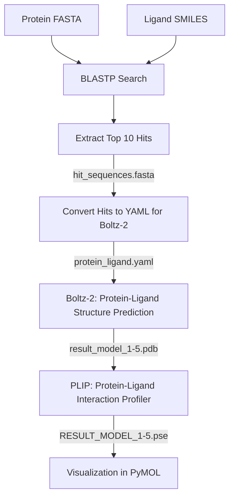

# Boltzflow

## Description
**Pipeline automatisé** pour identifier et prédire la structure de complexes protéine-ligand.

Le pipeline suit ces étapes principales :  
1. BLAST pour identifier les séquences homologues.  
2. Prédiction des structures protéine-ligand avec Boltz-2.  
3. Identification des interactions protéine-ligand avec PLIP.  
4. Visualisation des résultats de PLIP sur PyMOL
---

## Pipeline Workflow


## Usages
**Snakemake** (quelques soucis techniques avec Boltz et PLIP)
```
conda activate snakemake
cd Boltzflow/
snakemake --use-conda --cores 8
```
**Bash**
```
conda env create -f envs/boltz.yaml
conda activate boltz
cd Boltzflow/
bash Snakefile.sh
```

## Problèmes rencontrés
* Installation de BlastP impossible via conda : installation via [Index of /blast/executables/blast+/LATEST](https://ftp.ncbi.nlm.nih.gov/blast/executables/blast+/LATEST/)
     * Blastp est commenté dans le fichier `envs/boltz`, pas d'installation sur snakemake workflow
* Installation de boltz:
     * J'ai dû faire tourner Boltz sur CPU, les dernières version de CUDA sont incompatible avec mon GPU
     * Erreur lors du lancement: `` --> solution: retélécharger [`mol.tar`](https://huggingface.co/boltz-community/boltz-2/blob/main/mols.tar) et le décomprésser dans le dossier cache `.boltz`.

## Possibilités d’amélioration du pipeline
- (Exploiter GPU pour Boltz-2 et accélérer les prédictions sur de grands ensembles de hits.)
- Automatiser détection des poches catalytiques:
    - Identification des résidus catalytiques sur une structure de référence: avec PLIP
    - Identification des résidus correspondant dans les séquences hits: Python
    - Ajout de l'encart `constraints` dans les fichiers yaml, inputs de Boltz-2 (exemple ci-dessous)
```
constraints:
  - pocket:
      binder: B                              # <-- chain_id du ligand
      contacts: [ [ A, 829 ], [ A, 138 ] ]   # <-- chain_id de la protéine et n° des résid catalytiq 
```
- Intégrer une étape de docking pour optimiser la position du ligand: avec Autodock Tools ou Vina
- Ajouter des checks automatiques sur la qualité des structures prédictives: avec MolProbity.
- Stocker les résultats dans une base de données structurée pour analyses ultérieures.
- Étendre le calcul des descripteurs à des dynamiques moléculaires pour capturer la flexibilité du complexe et de la poche : avec GROMACS (nécessitera un workflow à part)
- Remplacer BlastP par FoldSeek afin d'obtenir directement des structures prédites ou non à partir de la query
